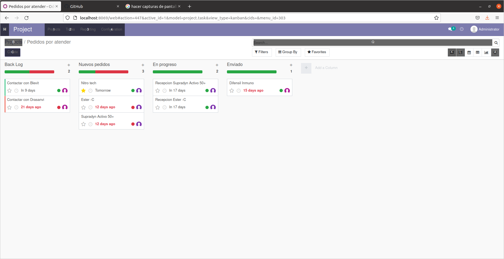

# 

Buenos días, vamos a explicaros en qué consiste nuestro trabajo.

Pensamos en hacer una página web acerca de productos dietéticos, fitness, productos que tratasen en general sobre el sistema digestivo.

## Página web

### Página principal

  

En esta captura podéis ver que disponemos de un menú colocado en la parte superior de la página, desde la cual podemos acceder a los distintos productos según su clasificación, y también a la sección de eventos, sobre la cual hablaremos más adelante.

  

Aquí explicamos un poco las cosas a las que nos compremetemos y está la opción de hacerse socio HW.

Tenemos los diferentes productos clasificados según su función dentro del organismo de cada cliente.

   

Aquí podéis apreciar nuestros valores, nuestra misión y los proveedores con los que tenemos contacto y se encargan de distribuirnos los productos más adecuados para cada función.

También se pueden leer las opiniones de nuestros clientes.

### Página sistema inmunitario y defensas

  

Esta página está solo dedicada a productos que traten el sistema inmunitario, teniendo la opción de comprarlos tras hacer click sobre ellos y añadirlos al carrito de compra como podréis ver en el siguiente ejemplo

  

### Página deportistas

  

Esta página está solo dedicada a productos cuyo enfoque está en aumentar el rendimiento deportivo tanto para profesionales, como para gente amateur.

## Formulario

Tenemos un botón el cual tiene escrito la palabra contáctanos y llevará a un formulario en el cual los clientes podrán hacer sus respectivas preguntas sobre cualquier cuestión relacionada con nuestra compañía<./p>  
 

## Tablero

Hemos descargado un módulo el cual nos ha permitido organizar nuestras tareas como empleados.

  
  
  

## Gestión tareas de Administración

  

## Productos

Hemos implementado unos productos con sus respectivos precios, los cuales los clientes podrán comprar de manera muy sencilla<./p>  
  

## Calendario

Hay ciertos días que tenemos tareas muy importantes que realizar, por eso las hemos dejado apuntadas en un calendario que nos ofrece Odoo tras haber instalado el módulo correspondiente<./p>  
  

## Eventos y campañas de marketing

Para darnos a conocer y fidelizar con nuestros clientes, hemos creado 2 eventos los cuales servirán para promocionarnos y así tener más probabilidad de éxito con nuestro proyecto.

  
  
  

## Sistema de comunicación interno

Para poder trabajar de manera más sencilla y cómoda entre nosotros los empleados, hemos desarrollado un sistema de chat interno. Aquí podréis ver un pequeño ejemplo

  
  
  
  

## Gestionar contactos y otros datos

Para tener a mano los datos de nuestros clientes, proveedores, etc. Hemos implementado un módulo el cual nos permite generar un archivo tipo Calc que guarda todos estos datos tan esenciales para cualquier empresa.

  
  

## Sistema de control de versiones y copias de seguridad

### Encriptación base de datos

Aquí hemos encriptado la base de datos, ya que contiene datos sensibles y no sería plato de buen gusto perderlos.

  

### Commits GitHub

  

### Ramas proyecto GitHub

    